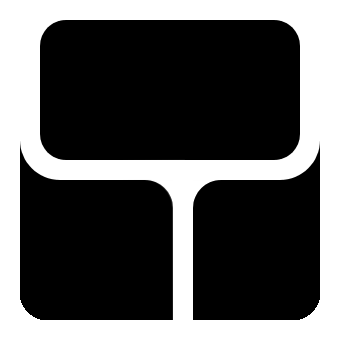

<p align="center"><a target="_blank" href="https://chromewebstore.google.com/detail/yee-mux/fjieejlgkgfmcoelccgobbpcngpnaoph"></a></p>
<h1 align="center"> Yee-mux </h1>
<p align="center"><a target="_blank" href="https://chromewebstore.google.com/detail/yee-mux/fjieejlgkgfmcoelccgobbpcngpnaoph"></a></p>
<p align="center">Muli task from the sidepanel.</p>

I made Yee Mux because I wanted an easy way to multitask on me macbook without having a million tabs open. 


## Getting Started

First, run the development server:

```bash
pnpm dev
# or
npm run dev
```

Open your browser and load the appropriate development build. For example, if you are developing for the chrome browser, using manifest v3, use: `build/chrome-mv3-dev`.

You can start editing the popup by modifying `popup.tsx`. It should auto-update as you make changes. To add an options page, simply add a `options.tsx` file to the root of the project, with a react component default exported. Likewise to add a content page, add a `content.ts` file to the root of the project, importing some module and do some logic, then reload the extension on your browser.

For further guidance, [visit our Documentation](https://docs.plasmo.com/)

## Making production build

Run the following:

```bash
pnpm build
# or
npm run build
```

This should create a production bundle for your extension, ready to be zipped and published to the stores.

